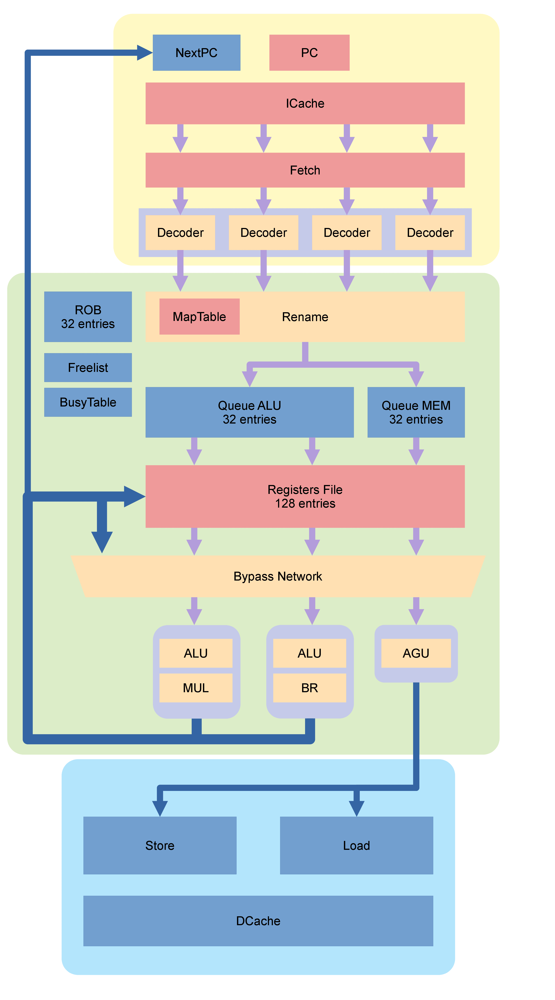

# Superscalar RISC-V32 Processor



[RISC-V Manual](https://riscv.org/wp-content/uploads/2019/12/riscv-spec-20191213.pdf)

## Dependencies
### Requirements

- Modelsim or [iverilog][1](simple tests)

### Recommends

- c
- riscv64-elf-gcc or [riscv-gnu-toolchain][2]
- riscv32-elf-binutils
- [elfbin][3]

## Building

```bash
$ git clone https://github.com/DonMaestro/risc-v.git
$ cd risc-v
$ make build
```

### UVM(out of order)

```bash
$ make uvm_test TARGET=module_name
```

## DOCUMENTATION(EN/[UA][4])

[1]: http://iverilog.icarus.com/
[2]: https://github.com/riscv-collab/riscv-gnu-toolchain
[3]: https://github.com/DonMaestro/elfbin.git
[4]: docs/modules_ua/README.md

## Repository tree
```bash
.
├── docs
│   ├── img
│   │   └── ...
│   ├── Makefile
│   ├── modules_ua
│   │   ├── README.md
│   │   └── ...
│   └── src
│       └── ...
├── Makefile
├── README.md
├── src
│   ├── core.v
│   └── ...
├── Test
│   ├── tb_core.sv
│   └── ...
├── uvm
│   ├── ringbuf
│   │   ├── agent.svh
│   │   ├── driver.svh
│   │   ├── env.svh
│   │   ├── interface.svh
│   │   ├── pkg.svh
│   │   ├── scoreboard.svh
│   │   ├── sequence.svh
│   │   └── test.svh
│   ├── ringbuf.sv
│   └── ...
└── ...
```

