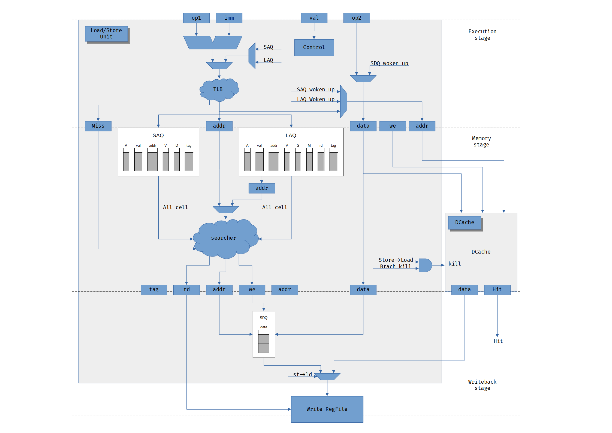

Load/Store Unit
===============

Store Address Instruction
-------------------------

- **A**\llocated
- **val**\id address
- **addr**\ess
- **V**\irtual address
- **D**\ata availability
- **tag**

Інструкція в модуль може прийти в трьох станах

1. адреса і дані
2. адреса
3. дані

Може відбутися так події:

- Промах TLB;
- Відсутність даних;
- Вбивство.

При першій ситуації в модуль прибуває повна інструкція з черги.
В модулі обраховується віртуальна адреса після чого відбувається
звернення в TLB для визначення фізичної адреси.
Відбувається запис в SAQ та кеш.
Наступного такту відбувається пошук на збіг вхідної адреси з адресами SAQ для
визначення адреси комірки в яку відбувся запис яка потрібно для запису
даних в наступні стадії.

Ситуації два. В модуль прибуває інструкція з черги лише з першим
виконаним залежним регістром. В модулі обраховується віртуальна адреса після
чого відбувається звернення в TLB для визначення фізичної адреси.
Після чого записується в таблицю SAQ.

Ситуація три. Дана ситуація формується якщо в даний модуль вже була відправлена
адреса. В модуль прибуває інструкція з черги лише з другим залежним регістром.
На це вказує відповідні біти.
Обраховується віртуальна адреса після чого відбувається звернення в TLB.
Дана ситуація не потребує виділенні нової комірки в SAQ оскільки запис вже
існує.
Наступного такту відбувається пошук на збіг вхідної адреси з адресами SAQ для
визначення адреси комірки в яку відбувся запис яка потрібно для запису
даних в наступні стадії.

Відсутність збігу адрес відбувається через оновлення TLB.
Оскільки віртуальні адреси в таблиці не встигли виконатися.
В даній ситуації зупиняється конвеєр і відбувається повторне звернення в TLB
для віртуальних адрес в таблиці SAQ поки не відбудеться збіг.
Після чого відбувається відновлення роботи.

В не залежності від ситуацій потрібно зберігати маску по які відбудеться
вбивство інструкції якщо в цьому є необхідність.

Store Data Instruction
----------------------

Дані інструкцій завантаження зберігаються окремо в модулі пам'яті з асинхронним
входом читання.

Load Instruction
----------------

Інструкція потрапляє в модуль. Обраховується адреса і записується
в чергу SAQ(Load Address Queue).

- **A**\llocated
- **val**\id address
- **addr**\ess
- **V**\irtual address
- a match in the **S**\AQ
- cache **M**\iss
- **rd** (destination register)
- **tag**

Виконана інструкція може видалитися з черги LAQ.
Нижче наведені причини затримки через які інструкція вважається не виконаною.

- Промах TLB;
- Збіг в черзі SAQ(Store Address Queue), але відсутні дані;
- Промах кешу;
- Вбивство.

Інструкцій прибуває в модуль і обраховується віртуальна адреса
після чого відбувається звернення в TLB.
Якщо промаху не відбулося записуємо в таблицю LAQ і відправляємо в кеш.
При промаху в модулі TLB в чергу відправляємо віртуальну адресу та
встановлюємо відповідний прапор. Інструкція повторно прокинеться для
того, щоб визначити фізичну адресу.

При другому етапі відбувається перевірка на збіг адреси в SAQ.
Якщо в SAQ відбувся збіг, але відсутнє встановлення прапор наявності даних.
Відбувається вбивство запита в кеш.
Інструкція прокинеться для повторного виконання.
Також відбувається пошук адреси для знаходження адреси комірки до якої буде
відбуватися звернення зміни прапорів,
а також визначення регістра призначення [1]_,
який потрібен для наступного етапу.

.. [1] В даному етапі вже доступний регістр призначення який потрібен в чергах
   для інструкцій які залежать від нього. Але через формування критичного шляху
   відправлення відбувається наступного такту в який регістр призначення
   відправляється. Це не дозволяє наперед відправити сигнал в черги
   для оминання регістрового файлу що формує не бажану затримку.

В третьому етапі може відбутися промах кешу.
Це станеться лише при відсутності збігу адреси в SAQ.
Для того, щоб опрацювати дану помилку потрібно адреса комірки LAQ яка
передається з попереднього етапу.
При промаху кешу інструкція залишається в черзі для повторного виконання її.
Для даного етапу потрібен біт який вказує присутність збігу в SAQ для
визначення джерела зчитування даних для регістрового файлу.

Якщо в модуль приходить сигнал вбивства інструкцій за маскою гілок через не
коректно визначену адресу при передбаченні гілки.
Інструкція не видаляється з черги оскільки залишається висока ймовірність
звернення за даною адресою в близькому майбутньому.
Інструкція виконується для того, щоб поновити кеш.

Проблема
--------

.. code-block:: 

   add s2,??,?? #s2=3
   add s1,??,?? #s1=2
   add a1,??,??
   add a2,??,??
   ...
   addi s1,s1,1
   sw  a1,0(s1) #s1==s2
   lw  a3,0(s1)
   sw  a2,0(s2)
   lw  a4,0(s2)
   ...

