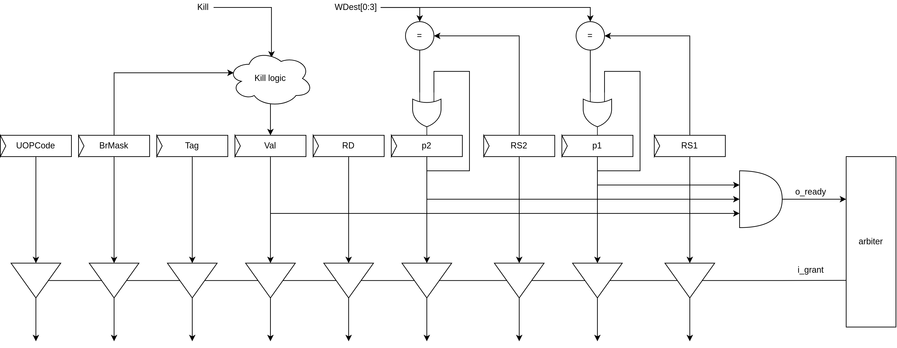

Queue
=====

.. image:: ../img/queue.pdf
   :width: 800
   :align: center

Даний модуль накопичує інструкції.
Черги можуть мати як один вихідний порт та декілька.
Кількість черг і вид залежить від групування модулів виконання.

Через можливу зміну порядку і наявність буфера
процесор збільшує пропускну здатність оскільки
маючи буфер збільшується шанс присутність готових інструкцій для виконання.

Перед записом в чергу залежні регістри інструкції
перевіряться на їх готовність в таблиці зайнятості (busy table).

Розмір черги залежить від розміру конвеєра.
У випадку промаху передбачення гілки з черги за допомогою маски видаляють
інструкції та в конвеєрі формується бульбашка.
Накопичена кількість інструкцій в черзі створює амортизовану подушку
за допомогою якої процесор продовжує працювати.
При цьому не шкодячи на продуктивність процесора.
Для цього черга повинна мати достатній розмір, а також бути заповнена.
Це досягається за допомогою введення пріоритету інструкцій.
Інструкції для перевірки переходу мають найвищий пріоритет.
При потраплянні такої інструкції в чергу вона чекає поки залежні регістри
виконаються і після чого зчитується оминаючи інші інструкції в черзі.
Що дозволяє продовжувати роботу навіть при присутності бульбашки в конвеєрі.

Пріоритет можна оминути якщо зробити окрему чергу для перевірки переходів.
Але це значно збільшує ресурсні затрати.

Slot
====

В комірці черги є:

- дійсність комірки;
- пріоритет;
- маска гілки;
- тег;
- залежні регістри;
- біти готовності залежних регістрів.

Готовність комірки до зчитування являється встановленні біти залежних інструкцій
і біт дійсності.

При зчитуванні комірки регістр призначення інструкції повертається до черги для
перевірки на збіг з залежних регістрами.
Тому виконання інструкцій для яких залежні дані ще не доступні не можливий.

В кожній комірці присутня комбінаційна логіка яка декодує (BrMask) і перевіряє
її з вхідною маскою. Що формує скидання дійсності комірки.
