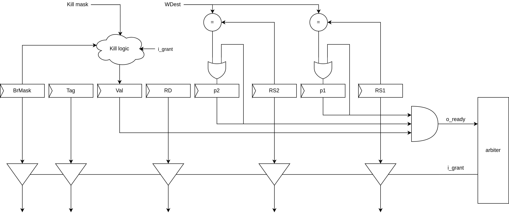

Queue
=====

.. image:: ../img/queue.png
   :width: 800
   :align: center

Даний модуль накопичує інструкції.

За допомогою даного модуля ми зменшуємо простої збільшуючи можливість
паралельно виконувати інші інструкції.

Також при випадку промаху передбачення гілки накопичена кількість
інструкцій в черзі створює амортизуючу подушку за допомогою якої процесор
продовжує працювати.
При присутності бульбашки в конвеєрі.

Для того, щоб збільшити 
Для цього потрібно найвищий пріоритет для інструкцій обрахунку гілок.

Також даний модуль збільшує пропускну здатність оскільки
інструкція чекає виконання залежних регістрів замість простою
в черзі може бути дістати які готові до виконання.

В комірці черги є:

- біт валідності;
- маска гілки;
- тег;
- залежні регістри;
- біти готовності залежних регістрів.

Готовність інструкції до виконання являється встановленні біт валідності,
біти залежних інструкцій.

Перед тим як інструкція запишеться в чергу залежні регістри
перевіряться на їх готовність за допомогою таблиці зайнятості.

