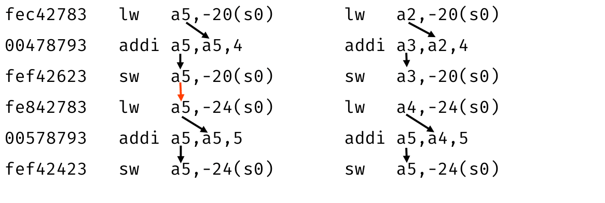
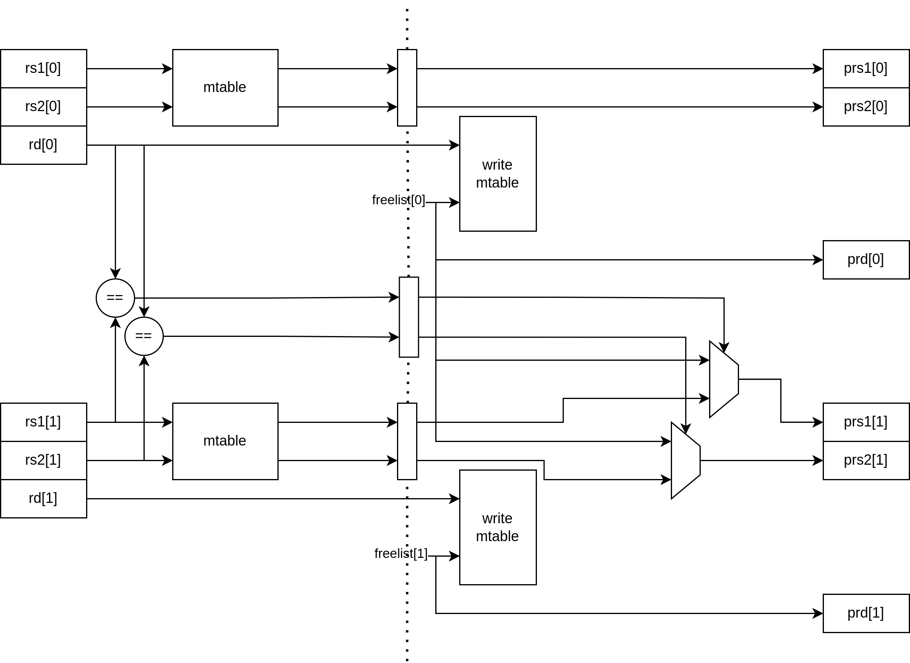

Rename
======

Етап перейменування являється етапом оптимізації.
Одно поточна програма не дає можливості для виконання декількох
інструкцій одночасно.

Розглянемо фрагмент коду:

На рисунку стрілочками позначено залежні регістри між інструкціями.
Програма проводить операції та записує результати в один регістр.
Тому дана програма виконується в один потік та виконання займає шість тактів.
Для прискорення виконання програми потребується збільшення тактової частоти.

В даному прикладі можливе прискорення виконання програми.
Розглянемо той самий приклад, але проведемо деякі маніпуляції.
Для кожного результівного регістра(rd) задамо незайнятий регістр.
не зберігає потрібної інформації.
Так проведемо заміну в регістрах інструкцій які залежать від даного регістра.
Результат наведений праворуч від оригінала.

Дану програму можна виконувати у два потоки та виконання займає вже три такти:

1. Зчитування даних з пам'яті в регістр a2 та a4;
2. Додавання записуючи результат в регістри a3 та a5 відповідно;
3. Запис результату в пам'ять з регістрів a3 та a5.

Дану оптимізацію можна виконати двома методами:

- програмний;
- фізичний.

Дану оптимізацію можна виконати на етапі компіляції.
Але за допомогою даного методу не можна розширити адресу.
І в стандарті на регістровий файл виділяється 32 комірки.
Тому що для регістрів виділено ширину в 5 біт.
Тому одночасно можна тримати 31 перейменований регістр,
оскільки регістр за нульовою адресою завжди зберігає нуль
і перейменування не можливе.
Це накладає обмеження на розмір черг яка в свою чергу
задає максимальну можливу кількість паралельного виконання інструкцій.
Збільшую розмір буфера зменшується кількість простоїв, бо збільшується
ймовірність знаходження в черзі інструкцій готових до виконання.
Тому збільшуючи розмір черг з перейменованих теоретично збільшує виконання
програми. Звісно інструкції програми не можна виконати одночасно.
Тому, що всі залежності прибрати не можна.

Проводить перейменовування являється краще.
Тому дає змогу підбирати розмір максимальної кількості перейменованих
регістрів в залежності від розміру черг і кількості модулів виконання.

Даний модуль відпрацьовує:

1. Читання перейменованих регістрів.
2. Порівняння залежних регістрів з минулими результівними.
3. Перевірка на нульовий регістр
4. Запис вільних регістрів в таблицю перейменувань.

В RISC-V архітектурі регістр за нульовою адресує завжди містить нуль.
Необхідність в перейменовуванні його нема.

В пакеті інструкцій є чотири інструкції.
Потрібно перевірити на збіг зчитаних з таблиці, а також з попередніми в
пакеті.
Оскільки кожна наступна інструкція може залежати від
попередніх інструкцій.
Тому, що вони запишуться лише наступного такту.
Бо наступного такту буде відбуватися перейменовування
наступного пакета інструкцій.

