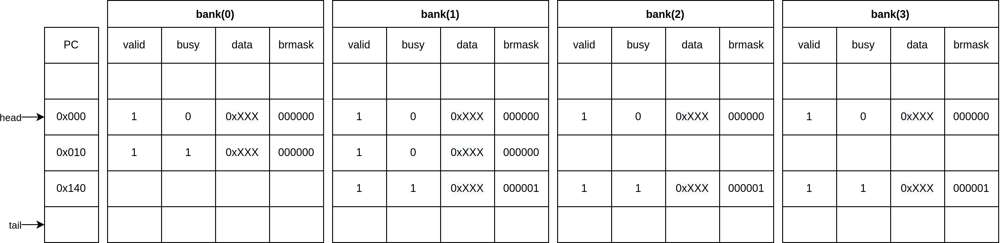

==============
Reorder Buffer
==============

Буфер змінного порядку або буфер відновлення послідовності дозволяє
відстежувати виконання інструкцій зберігаючи чітку послідовність.
Після модуля перейменовування в нас з'являється запитання як відстежувати
виконані інструкції. Тому, що після перейменування і виконання інструкції
відбувається процедура здійснення "commit". Якщо це зробити раніше
ми отримаємо не коректне значення оскільки даний регістр може бути
використаний для інших інструкцій.

Модуль побудований на основі кільцевого буфера.
Показник "tail" вказує на комірку для запису нової інструкції.
Показник "head" вказує на інструкції які готуються для commit.

В кожній банці є комірки в яких зберігаються інструкції.
Комірка банки має:

- Адресу для пакета інструкцій;
- Біт валідності;
- Біт зайнятості;
- Попередній регістр;
- Маска гілки.

В модулі є чотири банки в яких зберігається інструкції, які будуть виконуватися,
виконуються на цей момент або вже виконалися.
На це вказують біти валідності в зайнятості.
Після виконання інструкції сигнал повертається в даний модуль і скидає біт
зайнятості виконаної інструкції.

Запис відбувається всього пакета.
Кожна інструкція відповідно до банки.
Адреса зберігається окремо і представляє весь рядок.
В даному буфері зберігається вирівнення інструкцій тому номер банки вказує
на зміщення інструкції в пакеті. Тому ми можемо відновити адресу інструкції
і цим заощадити ресурси які виділяють для адреси.

Commit Stage
~~~~~~~~~~~~

Розглянемо якнайстарший пакет на який вказує показник head.
Якщо всі інструкції в даному пакеті виконалися, то ми можемо чітко сказати
що старе перейменоване значення оригінального регістра вже не потрібне.
Всі наступні інструкції залежать від нового вже виконаного перейменованого
регістра.
Відбувається коміт старого регістра і зміщується "head".
Отже, здійснення коміта відбувається в тій послідовність як і перейменовування.

Jump miss
~~~~~~~~~

При промаху передбачення гілки в модулі потрібно прибрати всі інструкції
які знаходяться після інструкції переходу гілки.
Це реалізовано за допомогою маски гілки.
